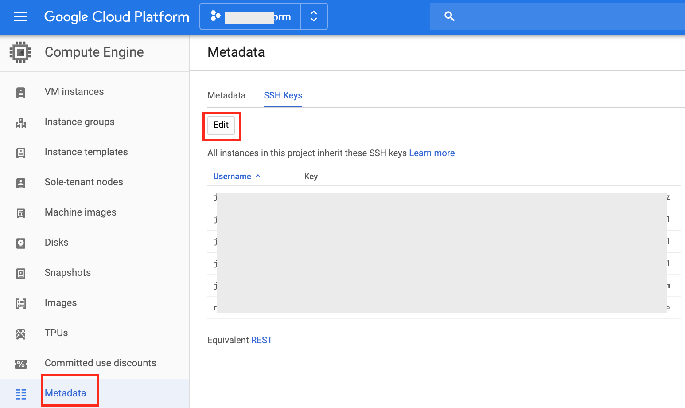
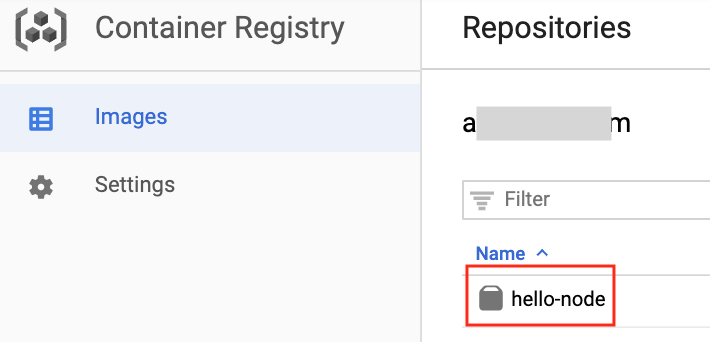
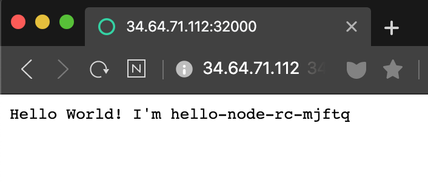
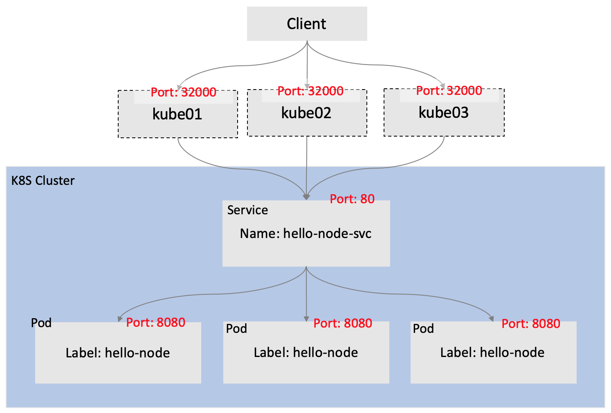

Kubernetes 클러스터 구축하기: Quick Start using Kubespray
=========================================================

#### 시나리오

1.	gcloud를 사용하여 3개의 gce instance를 생성하고
2.	kubespray를 통해
3.	kubernetes cluster를 구축하고
4.	node.js sample server를 docker image로 생성하고
5.	해당 이미지를 Google Container Registry(GCR)에 배포하고
6.	replicationController로 pod 생성하고
7.	nodePort로 service를 생성해서
8.	해당 웹페이지에 접속한다.

<br><br><br>

### gcloud sdk 설치

[macos에서 gcloud 설치하기](https://cloud.google.com/sdk/docs/quickstart-macos)

### instance 생성

-	local에서 원격으로 gcp instance(gce)를 kube01,kube02,kube03 이름으로 생성
-	원하는 instance name 및 옵션 변경/추가 해보자

```shell
# kube02, kube03도 생성
gcloud compute instances create kube01  \
--labels=username=jinwookchung  \
--zone=asia-northeast3-c  \
--machine-type=n1-highmem-2   \
--image-project=centos-cloud  \
--image-family=centos-7  \
--boot-disk-size=20GB  \
--scopes=cloud-platform  \
--tags=http-server,https-server
```

-	생성 확인

```shell
gcloud compute instances list
```

### ssh로 kube01에 접속

-	ssh key 생성

```shell
ssh-keygen
# 엔터,엔터 눌러 생성해도 되지만, 키 관리를 위해 키이름 변경 권고
```

#### gce metadata에 생성한 key 복사

##### gcloud를 사용하여 gce metadata에 ssh key 저장

```shell
echo "$(id -un):$(cat ~/.ssh/<local_sshkey>.pub)" > key-list
gcloud compute project-info add-metadata --metadata-from-file ssh-keys=key-list
```

##### console을 사용하여 gce metadata에 ssh key 저장

```shell
cat ~/.ssh/<local_sshkey>.pub
```

-	output을 복사하여, gce metadata ssh에 추가



### kube01의 key 복사

-	master로 사용할 kube01에 접속한다.

```shell
# private key와 key 생성시 사용한 username 사용
ssh -i ~/.ssh/id_rsa <username>@<kube01_external_ip>
```

##### gcloud sshkey 복사

```shell
echo "$(id -un):$(cat ~/.ssh/id_rsa.pub)" > key-list
gcloud compute project-info add-metadata --metadata-from-file ssh-keys=key-list
```

-	kubespray를 통한 쿠버 설치를 위해 kube01 키 사용
-	kube01에서 위의 과정 반복
-	metadata에 두개의 키가 추가 됐음을 확인

### kubernetes 설치

```shell
## kubespray 설치
sudo yum -y install python-pip git
git clone https://github.com/kubernetes-sigs/kubespray.git
cd kubespray
sudo pip install -r requirements.txt

## sample을 복사하여 생성된 인스턴스 ip 변경
cp -r inventory/sample  inventory/my-cluster
cd inventory/my-cluster

## node 정보 변경
vi inventory.ini
# - - - - - - - - - - - - - - - - - - - - - - - - - - - - - - - - - - - -
[all]
 kube01 ansible_host=10.178.15.191   # hostname, 인스턴스의 internal ip 입력
 kube02 ansible_host=10.178.15.192
 kube03 ansible_host=10.178.15.193

[kube-master]
 kube01

[etcd]
 kube01

[kube-node]
 kube02
 kube03
...
# - - - - - - - - - - - - - - - - - - - - - - - - - - - - - - - - - - - -

## kubernetes 설치 (10분정도 소요)
ansible-playbook -i /home/jinwookchung/kubespray/inventory/my-cluster/inventory.ini -v --become --become-user=root /home/jinwookchung/kubespray/cluster.yml
```

##### bash-completion 설치 및 kubectl alias 등록

-	kubectl command 사용시 root로 변경 [(링크)](https://kubernetes.io/docs/tasks/tools/install-kubectl/#enabling-shell-autocompletion)

-	bash-completion 설치

```shell
yum install bash-completion -y
source /usr/share/bash-completion/bash_completion
echo 'source <(kubectl completion bash)' >>~/.bashrc
```

-	kubectl alias 설정

```shell
echo "alias kubectl='/usr/local/bin/kubectl'" >> ~/.bashrc
```

-	편의를 위해 kubectl 대신 k 사용

```shell
echo "alias k=kubectl" >> ~/.bashrc
echo "complete -F __start_kubectl k" >> ~/.bashrc
source ~/.bashrc
```

### docker image 만들기

-	web 페이지 접속 시, hello world 문구와 hostname을 보여줄 server.js 생성

```js
var os = require('os');

var http = require('http');
var handleRequest = function(request, response) {
  response.writeHead(200);
  response.end("Hello World! I'm "+os.hostname());


  console.log("["+
                Date(Date.now()).toLocaleString()+
                "] "+os.hostname());
}
var www = http.createServer(handleRequest);
www.listen(8080);
```

-	Dockerfile 생성 (node carbon 사용)

```shell
FROM node:carbon
EXPOSE 8080
COPY server.js .
CMD node server.js > log.out
```

-	Docker 패키징 [(참고)](https://cloud.google.com/container-registry/docs/pushing-and-pulling)

```shell
docker build -t gcr.io/<gcp_project_name>/hello-node:v1 .
# [asia 데이터 센터]/[해당프로젝트이름]/[이미지이름:버전]
```

-	로컬에서 Container Registry 인증

```shell
gcloud auth configure-docker
```

-	gcr에 이미지 저장

```shell
docker push asia.gcr.io/<gcp_project_name>/hello-node:v1
```



<br><br>

### 쿠버네티스에 서비스 배포하기

<br>

##### ReplicationController object 등록

-	hello-node-rc.yaml 생성

```shell
apiVersion: v1
kind: ReplicationController
metadata:
  name: hello-node-rc
spec:
  replicas: 3
  selector:
    app: hello-node
  template:
    metadata:
      name: hello-node-pod
      labels:
        app: hello-node
    spec:
      containers:
      - name: hello-node
        image: gcr.io/accu-platform/hello-node:v1
        imagePullPolicy: Always
        ports:
        - containerPort: 8080
```

-	rc 등록

```shell
k create -f hello-node-rc.yaml
```

-	rc 등록 확인

```shell
k get rc

NAME            DESIRED   CURRENT   READY   AGE
hello-node-rc   3         3         3       2m
```

-	pod 생성 확인

```shell
k get pod

NAME                  READY   STATUS    RESTARTS   AGE
hello-node-rc-56xt9   1/1     Running   0          2m
hello-node-rc-cmb26   1/1     Running   0          2m
hello-node-rc-mjftq   1/1     Running   0          2m
```

-	전체 확인 (생성되어 있는 모든 object을 보여준다)

```shell
k get all
```

##### service object 등록

-	hello-node-svc.yaml 생성

```shell
# nodeport로 service를 사용하면, port range는 30000-32767
apiVersion: v1
kind: Service
metadata:
  name: hello-node-svc
spec:
  selector:
    app: hello-node
  ports:
    - port: 80
      protocol: TCP
      targetPort: 8080
      nodePort: 32000  
  type: NodePortw
```

-	service 등록

```shell
k create -f hello-node-svc.yaml
```

-	확인

```shell
k create svc

NAME             TYPE        CLUSTER-IP     EXTERNAL-IP   PORT(S)        AGE
hello-node-svc   NodePort    10.233.41.49   <none>        80:32000/TCP   26m
kubernetes       ClusterIP   10.233.0.1     <none>        443/TCP        35m
```

##### 웹페이지에서 확인

-	현재 gcp계정에서 node 정보 확인

```shell
gcloud compute instances list

NAME        ZONE               MACHINE_TYPE  PREEMPTIBLE  INTERNAL_IP    EXTERNAL_IP    STATUS
kube01      asia-northeast3-c  n1-highmem-4               10.178.15.198  34.64.241.125  RUNNING
kube02      asia-northeast3-c  n1-highmem-4               10.178.15.199  34.64.71.112   RUNNING
kube03      asia-northeast3-c  n1-highmem-4               10.178.15.200  34.64.168.165  RUNNING
```

-	external ip와 nodeport 32000를 사용해서 웹페이지 접속 (웹페이지 접속마다 pod호스트명이 변경됨)



<br><br>

### Client가 pod에 접속하는 과정



<br><br><br><br><br>

Kubernetes 클러스터 구축하기: Quick Start using kubeadm
=======================================================

#### 시나리오

1.	3개의 노드를 1개의 마스터노드와 2개의 워커노드로 사용해서
2.	모든 노드에 kubeadm, kubelet, kubectl 설치하고
3.	스왑 꺼주고
4.	마스터의 kubeadm 초기화하고
5.	클러스터링

<br>

도커 설치
---------

-	모든 노드에 설치
-	root로 실행

```shell
yum install docker -y
systemctl start docker
```

<br>

kubeadm, kubelet, kubectl 설치
------------------------------

-	모든 노드에서 실행
-	root로 실행

```shell
cat << EOF > /etc/yum.repos.d/kubernetes.repo
[kubernetes]
name=Kubernetes
baseurl=https://packages.cloud.google.com/yum/repos/kubernetes-el7-\$basearch
enabled=1
gpgcheck=1
repo_gpgcheck=1
gpgkey=https://packages.cloud.google.com/yum/doc/yum-key.gpg https://packages.cloud.google.com/yum/doc/rpm-package-key.gpg
exclude=kubelet kubeadm kubectl
EOF

# Set SELinux in permissive mode (effectively disabling it)
setenforce 0
sed -i 's/^SELINUX=enforcing$/SELINUX=permissive/' /etc/selinux/config

yum install -y kubelet kubeadm kubectl --disableexcludes=kubernetes

systemctl enable --now kubelet
```

<br>

swap 끄기
---------

-	메모리 가용량을 높이기 위해 디스크를 내리는 행위
-	디스크로 메모리가 스와핑되는 행위는 쿠버의 방향성과 맞지 않음, 쿠버가 알아서 관리
-	스왑 발생시 속도가 느려지는 이슈 발생
-	1.8이후로 스왑을 비활성화해야 작동, 비활성화 안하면 kubelet이 안돌아감

```shell
# swap 끄기 (일회성)
sudo swapoff -a  
# 영구적용
sudo sed -i '/ swap / s/^\(.*\)$/#\1/g' /etc/fstab
```

<br>

마스터 노드 초기화 (마스터 노드만 실행)
---------------------------------------

-	root로 실행

```shell
kubeadm init  
```

-	완료 후, output 확인

```
Your Kubernetes control-plane has initialized successfully!

To start using your cluster, you need to run the following as a regular user:

  mkdir -p $HOME/.kube
  sudo cp -i /etc/kubernetes/admin.conf $HOME/.kube/config
  sudo chown $(id -u):$(id -g) $HOME/.kube/config

You should now deploy a pod network to the cluster.
Run "kubectl apply -f [podnetwork].yaml" with one of the options listed at:
  https://kubernetes.io/docs/concepts/cluster-administration/addons/

Then you can join any number of worker nodes by running the following on each as root:

kubeadm join 10.xxx.xx.xx:6443 --token jf81wq.rwrxxxxxxxxxxxxm \
    --discovery-token-ca-cert-hash sha256:0a0e1995b315b3e7a1ee40464adfce6a101d3936cbfc6xxxxxxxxxxxxxxxxxxx
```

-	kube config 설정 (일반유저로 실행)

```shell
mkdir -p $HOME/.kube
sudo cp -i /etc/kubernetes/admin.conf $HOME/.kube/config
sudo chown $(id -u):$(id -g) $HOME/.kube/config
```

<br>

워커 노드 조인하여 클러스터 설정
--------------------------------

-	admin init을 통해 얻은 cluster join 코드 워커에서 실행
-	root로 실행

```shell
kubeadm join 10.xxx.xx.xx:6443 --token jf81wq.rwrxxxxxxxxxxxxm \
    --discovery-token-ca-cert-hash sha256:0a0e1995b315b3e7a1ee40464adfce6a101d3936cbfc6xxxxxxxxxxxxxxxxxxx
```

<br>

확인
----

```shell
kubectl get nodes

NAME        STATUS   ROLES    AGE   VERSION
kube01   Ready    master   15m   v1.18.4
kube02   Ready    <none>   15m   v1.18.4
kube03   Ready    <none>   15m   v1.18.4
```

<br><br>

#### 참고

-	[Installing kubeadm](https://kubernetes.io/docs/setup/production-environment/tools/kubeadm/install-kubeadm/)
-	[Creating a single control-plane cluster with kubeadm](https://kubernetes.io/docs/setup/production-environment/tools/kubeadm/create-cluster-kubeadm/)
